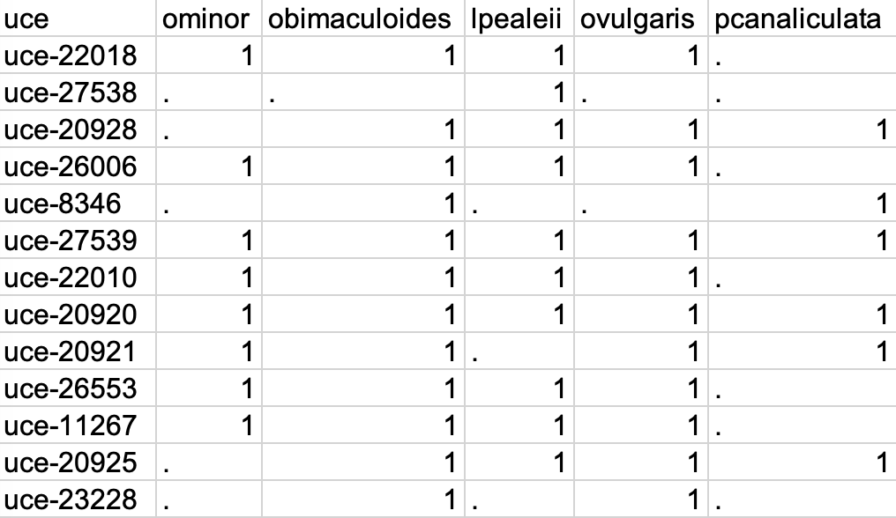

# UCE Bait Design

## Data

The genomes used for bait design were *Loligo pealei* (now *Doryteuthis pealei*, Titus Brown, unpublished data <http://ivory.idyll.org/blog/2014-loligo-transcriptome-data.html>), *Octopus vulgaris* (Zarrella et al. 2019, NCBI ref GCA_003957725.1), *Octopus bimaculoides* (Albertin et al. 2015, NCBI ref GCF_001194135.1), and *Octopus minor* (Kim et al. 2018, <http://gigadb.org/dataset/100503>). We also tested baits in silico against the genome of the golden apple snail, *Pomacea canaliculata* (Liu et al. 2018, supplemental material) to assess their ability to amplify UCEs in non-cephalopod molluscs.

## UCE development

We conducted UCE bait design using Phyluce version 1.6.6 (Faircloth 2016; Faircloth et al. 2012), mostly following procedures given in Tutorial IV (Identifying UCE Loci and Desiging Baits To Target Them) at <https://phyluce.readthedocs.io/> including probe design and in silico testing. Data were converted to .fasta and .2bit files where necessary.

Initial probe design was conducted in early 2020, when few cephalopod genomes were available compared to today. We used the *O. vulgaris* genome as the base genome for bait development. We generated simulated reads from each genome using the **art_illumina** function from ART (Huang et al. 2012) with length 100 bp, insert size of 200bp, and standard deviation of 150. Code for *O. vulgaris* is given below, similar code was run for each species.

```         
art_illumina \
    --paired \
    --in ../genomes/octopus.vulgaris/octopus.vulgaris.fasta \
    --out octopus.vulgaris.reads \
    --len 100 --fcov 2 --mflen 200 --sdev 150 -ir 0.0 -ir2 0.0 -dr 0.0 -dr2 0.0 -qs 100 -qs2 100 -na
```

Reads for each species were merged using a bash script.

```         
for critter in octopus.vulgaris octopus.bimaculoides octopus.minor loligo.pealeii;
    do
        echo "working on $critter";
        touch $critter-pe100-reads.fq;
        cat $critter-pe100-reads1.fq > $critter-pe100-reads.fq;
        cat $critter-pe100-reads2.fq >> $critter-pe100-reads.fq;
        rm $critter-pe100-reads1.fq;
        rm $critter-pe100-reads2.fq;
        gzip $critter-pe100-reads.fq;
    done;
```

Due to technical issues we used **NextGenMap** (Sedlazeck et al. 2013) instead of **stampy** (Gerton and Goodson 2011) to align the reads for each species to the base genome and convert the output to BAM format, using the following code and substituting the input file for each species for \$readfile in turn.

`ngm –r octopus.vulgaris.fasta –q $readfile –b –o $outfile –t 4`

Finally we removed unmapped reads using **samtools** (Li et al. 2009). This produced a set of conserved regions where simulated sequence data for individual species mapped to the base genome with a divergence of \< 5%.

```         
for critter in octopus.vulgaris octopus.bimaculoides octopus.minor loligo.pealeii;
    do
        samtools view -h -F 4 -b $critter/$critter-to-triCas1.bam > $critter/$critter-to-triCas1-MAPPING.bam;
        rm $critter/$critter-to-triCas1.bam;
        ln -s ../$critter/$critter-to-triCas1-MAPPING.bam all/$critter-to-triCas1-MAPPING.bam;
    done;
```

BAM files were converted to BED files using **bedtools** (Quinlan et al. 2010), and BED file contents were sorted by scaffold and position, and proximate positions were then merged.

```         
for i in ../alignments/*MAPPING.bam; do echo $i; bedtools bamtobed -i $i -bed12 > `basename $i`.bed; done

for i in *.bed; do echo $i; bedtools sort -i $i > ${i%.*}.sort.bed; done

for i in *.bam.sort.bed; do echo $i; bedtools merge -i $i > ${i%.*}.merge.bed; done

for i in *.bam.sort.merge.bed; do wc -l $i; done
```

At this point the number of regions that putatively aligned with the base genome were:

| Putatively aligned regions | Species                       |
|----------------------------|-------------------------------|
| 2,625,555                  | *Loligo (Doryteuthis) pealei* |
| 4,503,649                  | *Octopus bimaculoides*        |
| 4,475,396                  | *Octopus minor*               |

We then used **phyluce** to strip masked loci from the set and find alignment intervals that were shared among taxa, and counted how many intervals were shared between ovulgaris and the other taxa.

```         
for i in *.sort.merge.bed;
    do
        phyluce_probe_strip_masked_loci_from_set \
            --bed $i \
            --twobit ../genomes/octopus.vulgaris/octopus.vulgaris.2bit \
            --output ${i%.*}.strip.bed \
            --filter-mask 0.25 \
            --min-length 80
    done;

phyluce_probe_query_multi_merge_table \
    --db cephs-to-ovulgaris.sqlite \
    --base-taxon ovulgaris

Loci shared by ovulgaris + 0 taxa:	1,856,246.0
Loci shared by ovulgaris + 1 taxa:	1,856,246.0
Loci shared by ovulgaris + 2 taxa:	672,568.0
Loci shared by ovulgaris + 3 taxa:	42,105.0
```

Using **phyluce** we then extracted 160bp sequences from the base genome corresponding to conserved regions to use as targets for temporary baits.

```         
phyluce_probe_get_genome_sequences_from_bed \
        --bed ovulgaris+3.bed  \
        --twobit ../base/octopus.vulgaris.2bit \
        --buffer-to 160 \
        --output ovulgaris+3.fasta
        
phyluce_probe_get_tiled_probes \
    --input ovulgaris+3.fasta \
    --probe-prefix "uce-" \
    --design cephalopoda-v1 \
    --designer warren \
    --tiling-density 3 \
    --two-probes \
    --overlap middle \
    --masking 0.25 \
    --remove-gc \
    --output ovulgaris+3.temp.probes

phyluce_probe_easy_lastz \
    --target ovulgaris+3.temp.probes \
    --query ovulgaris+3.temp.probes \
    --identity 50 --coverage 50 \
    --output ovulgaris+3.temp.probes-TO-SELF-PROBES.lastz

phyluce_probe_remove_duplicate_hits_from_probes_using_lastz \
    --fasta ovulgaris+3.temp.probes  \
    --lastz ovulgaris+3.temp.probes-TO-SELF-PROBES.lastz \
    --probe-prefix=uce-
```

After aligning probes and removing duplicates, we still were left with a large number of candidates (13689 loci, 85227 probes). We further reduced this set by aligning the baits against the genome of the golden apple snail, *Pomacea canaliculata*, resulting in 4718 conserved loci and 39102 probes using a minimum sequence identity of 50.

```         
phyluce_probe_run_multiple_lastzs_sqlite \
    --probefile ../bed/ovulgaris+3.temp-DUPE-SCREENED.probes \
    --scaffoldlist pomacea.canaliculata loligo.pealeii octopus.bimaculoides octopus.minor octopus.vulgaris \
    --genome-base-path ../genomes \
    --identity 50 \
    --cores 8 \
    --db ovulgaris+3+pcanaliculata.sqlite \
    --output ceph-genome-lastz
```

We aligned each of these candidate probes to each exemplar genome and extracted the matching sequences, and then created tiled probes to target conserved sites at candidate loci across all exemplar genomes. These probes were aligned and filtered to remove duplicates. We then ran **phyluce_probe_queri_multi_fasta_table** to collect information about shared loci across species.

```         
phyluce_probe_slice_sequence_from_genomes \
    --conf scaffolds.conf \
    --lastz Results \
    --probes 180 \
    --output ceph-genome-fasta

phyluce_probe_get_multi_fasta_table \
    --fastas ./newfasta \
    --output multifastas.sqlite \
    --base-taxon octopus.vulgaris
    
phyluce_probe_query_multi_fasta_table \ 
    --db multifastas.sqlite \
    --base-taxon ovulgaris

Loci shared by 0 taxa:	19,937.0
Loci shared by 1 taxa:	19,937.0
Loci shared by 2 taxa:	18,743.0
Loci shared by 3 taxa:	13,689.0
Loci shared by 4 taxa:	4,718.0
Loci shared by 5 taxa:	1,194.0
```

Using sqlite we constructed a table of which UCEs were matched in each genome, formatted as below, with **1** denoting a uce that was matched and **.** denoting a uce that was not matched in each species. The full table is provided in ./data/matche_table.csv

{width="584"}

## In silico testing

As a sanity test, we simulated sequencing using the candidate bait set on the exemplar genomes, extracting simulated sequences with a flanking region of 400bp on each side.

```         
phyluce_probe_slice_sequence_from_genomes \
  --conf ceph-genome.conf \
  --lastz Results \
  --output ceph-genome-fasta \
  --flank 400 \
```

We used these to assemble contigs and extract .fasta data, which we then combined into a single file for each locus and aligned and trimmed, following settings for the standard **phyluce** workflow.

```         
phyluce_assembly_match_contigs_to_probes \
    --contigs ceph-genome-fasta \
    --probes ../probe-design/ceph-v1-master-probe-list-DUPE-SCREENED.fasta \
    --output in-silico-lastz \
    --min-coverage 67 \
    --log-path log

phyluce_assembly_get_match_counts \
    --locus-db in-silico-lastz/probe.matches.sqlite \
    --taxon-list-config in-silico-ceph-taxon-sets.conf \
    --taxon-group 'all' \
    --output taxon-sets/insilico-incomplete/insilico-incomplete.conf \
    --log-path log \
    --incomplete-matrix
    
From insilico-incomplete directory:

phyluce_assembly_get_fastas_from_match_counts \
    --contigs ../../ceph-genome-fasta \
    --locus-db ../../in-silico-lastz/probe.matches.sqlite \
    --match-count-output insilico-incomplete.conf \
    --output insilico-incomplete.fasta \
    --incomplete-matrix insilico-incomplete.incomplete \
    --log-path log

phyluce_align_seqcap_align \
    --fasta insilico-incomplete.fasta \
    --output mafft \
    --taxa 5 \
    --incomplete-matrix \
    --cores 8 \
    --no-trim \
    --output-format fasta \
    --log-path log

phyluce_align_get_gblocks_trimmed_alignments_from_untrimmed \
    --alignments mafft \
    --output mafft-gblocks \
    --b1 0.5 \
    --b4 8 \
    --cores 8 \
    --log log

phyluce_align_remove_locus_name_from_nexus_lines \
    --alignments mafft-gblocks \
    --output mafft-gblocks-clean \
    --cores 8 \
    --log-path log

phyluce_align_get_align_summary_data \
    --alignments mafft-gblocks-clean \
    --cores 8 \
    --log-path log

phyluce_align_get_only_loci_with_min_taxa \
    --alignments mafft-gblocks-clean \
    --taxa 5 \
    --output mafft-gblocks-70p \
    --percent 0.75 \
    --cores 8 \
    --log log
```

Finally we used these data to generate a 70% complete matrix, which was then used to build a tree using raxml (Stamatakis 2014).

```         
phyluce_align_format_nexus_files_for_raxml \
    --alignments mafft-gblocks-70p \
    --output mafft-gblocks-70p-raxml \
    --log-path log --charsets

raxmlHPC-PTHREADS-SSE3 -m GTRGAMMA -N 20 -p 772374015 -n BEST -s mafft-gblocks-70p.phylip -o menmol1 -T 8
```


The phylogeny built from the simulated sequences produced the expected results, with the three species from genus *Octopus* clustered together, *D. pealei* more distantly related, and *P. canaliculata* substantially more distantly related to all cephalopods.

As a final step probes were trimmed and duplicates removed using **seqkit** (Shen et al., 2024) and **sequence_cleaner** (<https://biopython.org/wiki/Sequence_Cleaner>). Results are in **data/clear_trimmed.fasta**

```         
./seqkit grep -r -f uce-list ceph-v1-master-probe-list-DUPE-SCREENED.fasta -o trimmed.fasta
python sequence_cleaner.py trimmed.fasta

./seqkit stats clear_trimmed.fasta
```

## Citations

Albertin, Caroline B., Oleg Simakov, Therese Mitros, Z. Yan Wang, Judit R. Pungor, Eric Edsinger-Gonzales, Sydney Brenner, Clifton W. Ragsdale, and Daniel S. Rokhsar. 2015. "The Octopus Genome and the Evolution of Cephalopod Neural and Morphological Novelties." Nature 524 (7564): 220--24.

Faircloth, Brant C., John E. McCormack, Nicholas G. Crawford, Michael G. Harvey, Robb T. Brumfield, and Travis C. Glenn. 2012. "Ultraconserved Elements Anchor Thousands of Genetic Markers Spanning Multiple Evolutionary Timescales." Systematic Biology 61 (5): 717--26.

Faircloth, Brant C. 2016. "PHYLUCE Is a Software Package for the Analysis of Conserved Genomic Loci." Bioinformatics 32 (5): 786--88.

Huang, Weichung, Leping Li, Jason R Myers, and Gabor T Marth. ART: a next-generation sequencing read simulator, Bioinformatics (2012) 28 (4): 593-594

Kim, Bo-Mi, Seunghyun Kang, Do-Hwan Ahn, Seung-Hyun Jung, Hwanseok Rhee, Jong Su Yoo, Jong-Eun Lee, et al. 2018. "The Genome of Common Long-Arm Octopus Octopus Minor." GigaScience 7 (11). <https://doi.org/10.1093/gigascience/giy119>.

Li, Heng, Bob Handsaker, Alec Wysoker, Tim Fennell, Jue Ruan, Nils Homer, Gabor Marth, Goncalo Abecasis, Richard Durbin, 1000 Genome Project Data Processing Subgroup, The Sequence Alignment/Map format and SAMtools, Bioinformatics, Volume 25, Issue 16, August 2009, Pages 2078--2079, <https://doi.org/10.1093/bioinformatics/btp352>

Liu, Conghui, Yan Zhang, Yuwei Ren, Hengchao Wang, Shuqu Li, Fan Jiang, Lijuan Yin, et al. 2018. "The Genome of the Golden Apple Snail Pomacea Canaliculata Provides Insight into Stress Tolerance and Invasive Adaptation." GigaScience 7 (9). <https://doi.org/10.1093/gigascience/giy101>.

Lunter Gerton, and Martin Goodson. Stampy: a statistical algorithm for sensitive and fast mapping of Illumina sequence reads. Genome Res. 2011 Jun;21(6):936-9. doi: 10.1101/gr.111120.110. Epub 2010 Oct 27. PMID: 20980556; PMCID: PMC3106326.

Quinlan, Aaron R., Ira M. Hall, BEDTools: a flexible suite of utilities for comparing genomic features, Bioinformatics, Volume 26, Issue 6, March 2010, Pages 841--842, <https://doi.org/10.1093/bioinformatics/btq033>

Sedlazeck, Fritz J., Philipp Rescheneder, and Arndt von Haeseler. 2013. NextGenMap: fast and accurate read mapping in highly polymorphic genomes. Bioinformatics, Vol. 29, No. 21., pp. 2790-2791, <doi:10.1093/bioinformatics/btt468>

Shen, Wei, Botond Sipos, and Liuyang Zhao. 2024. SeqKit2: A Swiss Army Knife for Sequence and Alignment Processing. ***iMeta*** e191. [doi:10.1002/imt2.191](https://doi.org/10.1002/imt2.191).

Stamatakis, Alexandros. RAxML version 8: a tool for phylogenetic analysis and post-analysis of large phylogenies, *Bioinformatics*, Volume 30, Issue 9, May 2014, Pages 1312--1313, <https://doi.org/10.1093/bioinformatics/btu033>

Zarrella, Ilaria, Koen Herten, Gregory E. Maes, Shuaishuai Tai, Ming Yang, Eve Seuntjens, Elena A. Ritschard, et al. 2019. "The Survey and Reference Assisted Assembly of the Octopus Vulgaris Genome." Scientific Data 6 (1): 13.
